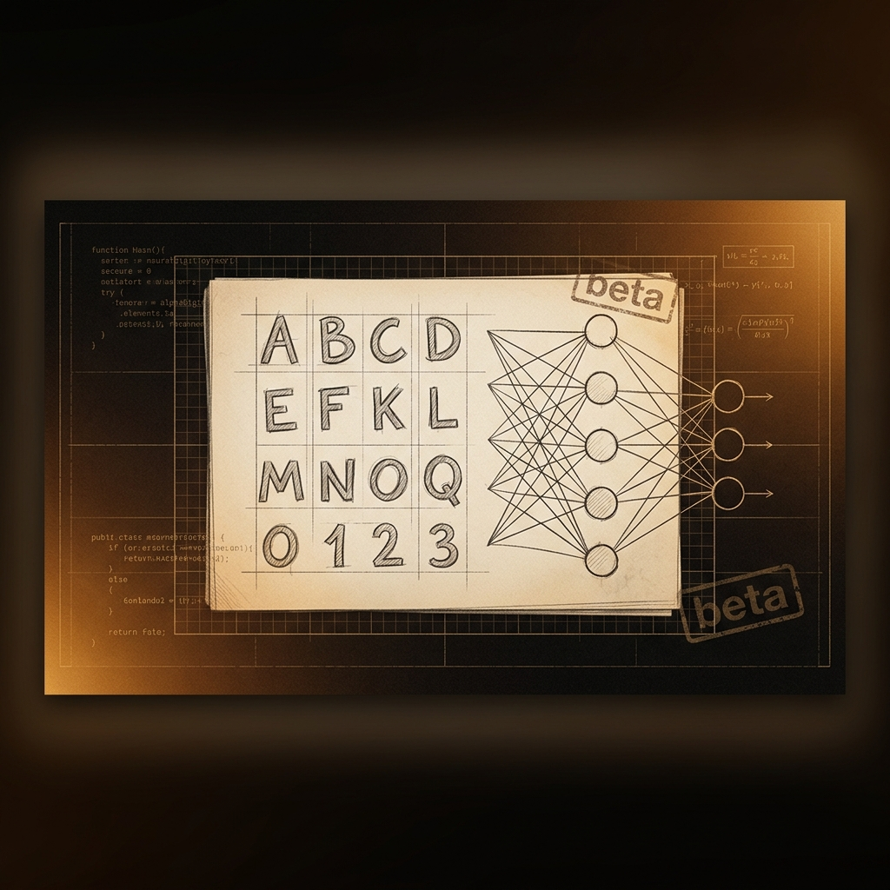

# HandDrawn AlphaDigit Recognizer — Early Prototype

<p align="center">
  
</p>

## Overview

The **early prototype** of the HandDrawn AlphaDigit Recognizer — a foundational experiment in building a hand-drawn character recognition system. This project represents the initial exploration phase that later evolved into the more polished [Handwritten AlphaNumeric Recognizer](https://github.com/srivatsacool/Handwritten_AlphaNumeric_Recognizer_using_CNN) and [Numeric Recognizer](https://github.com/srivatsacool/Handwritten-Numeric-Recognizer-using-CNN) projects.

---

## Key Features

- **Prototype implementation** — Early-stage character recognition pipeline
- **Canvas-based input** — Draw characters for recognition
- **Basic CNN model** — Initial neural network architecture for digit/letter classification
- **Foundation project** — Served as the starting point for improved iterations

---

## Technology Stack

| Technology | Purpose |
|---|---|
| Python 3 | Core language |
| TensorFlow / Keras | CNN model |
| OpenCV | Image preprocessing |
| NumPy | Array operations |

---

## Evolution

```text
HandDrawn AlphaDigit Recognizer (this prototype)
        ↓
Handwritten Numeric Recognizer (MNIST-focused)
        ↓
Handwritten AlphaNumeric Recognizer (EMNIST, full A-Z + 0-9)
```

---

## Installation & Setup

```bash
git clone https://github.com/srivatsacool/HandDrawn-AplhaDigit-Recognizer
cd HandDrawn-AplhaDigit-Recognizer
pip install -r requirements.txt
```

---

## Author

**Srivatsa Gorti**

---
